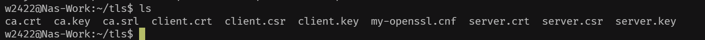

<!--more-->

## FRP配置TLS双向加密连接

记录一下frp如何配置TLS双向加密，以防后面忘记如何配置。

建立任意一个文件夹，在文件夹下创建`my-openssl.cnf`文件，并写入以下配置：

```ini
[ ca ]
default_ca = CA_default
[ CA_default ]
x509_extensions = usr_cert
[ req ]
default_bits        = 2048
default_md          = sha256
default_keyfile     = privkey.pem
distinguished_name  = req_distinguished_name
attributes          = req_attributes
x509_extensions     = v3_ca
string_mask         = utf8only
[ req_distinguished_name ]
[ req_attributes ]
[ usr_cert ]
basicConstraints       = CA:FALSE
nsComment              = "OpenSSL Generated Certificate"
subjectKeyIdentifier   = hash
authorityKeyIdentifier = keyid,issuer
[ v3_ca ]
subjectKeyIdentifier   = hash
authorityKeyIdentifier = keyid:always,issuer
basicConstraints       = CA:true
```

生成默认 ca:

```sh
openssl genrsa -out ca.key 2048 #生成长度为2048位的RSA私钥文件
openssl req -x509 -new -nodes -key ca.key -subj "/CN=example.ca.com" -days 3650 -out ca.crt #使用私钥文件(ca.key)生成自签名证书,有效期为10年

#也可以使用替代下述替代,会提示输入 Country Name、Organization Name 等
openssl req -x509 -new -nodes -key ca.key -days 3650 -out ca.crt
```

生成服务端证书:

```sh
openssl genrsa -out server.key 2048 #服务端证书

#生成服务端证书签名请求
openssl req -new -sha256 -key server.key \
    -subj "/C=XX/ST=DEFAULT/L=DEFAULT/O=DEFAULT/CN=server.com" \
    -reqexts SAN \
    -config <(cat my-openssl.cnf <(printf "\n[SAN]\nsubjectAltName=DNS:localhost,IP: FRP服务端公网 IP,DNS:example.server.com")) \
    -out server.csr

#使用CA跟证书和私钥对csr进行签名，签发服务端证书,有效期365天
openssl x509 -req -days 5000 -sha256 \
	-in server.csr -CA ca.crt -CAkey ca.key -CAcreateserial \
	-extfile <(printf "subjectAltName=DNS:localhost,IP: FRP服务端公网 IP,DNS:example.server.com") \
	-out server.crt
```

> Tips:
>
>  1、 -subj “/C=XX/ST=DEFAULT/L=DEFAULT/O=DEFAULT/CN=server.com” 指的是证书的证书持有者的身份信息，可以根据实际情况替换吗，这里使用默认DEFAULT
>
> /CN国家代码 /ST省份 /L城市 /O 组织名称 /CN通用名称
>
> ```bash
> #示例 
> -subj "/C=CN/ST=Beijing/O=\"My Company, Ltd\"/CN=app.example.com"
> ```
>
> 
>
>  2、config参数结合实际填写，这里SAN字段是自签名校验证书是否有效的关键配置
>
> ```bash
> -config <(cat my-openssl.cnf <(printf "\n[SAN]\nsubjectAltName=DNS:localhost,IP:127.0.0.1,DNS:example.server.com"))
> ```
>
>  SAN(subjectAltName)字段后面跟的DNS和IP是指该证书(记录)允许的域名或IP。
>
>  e.g: SAN=DNS:a.com,DNS:b.com IP:192.168.1.12
>
>  访问域名 a.com san条目 a.com 匹配 结果 成功->安全
>
>  访问域名 c.com san条目 a.com 不匹配 结果 失败->不安全
>
>  访问域名 192.168.1.12 san条目 192.168.1.12 结果 成功->安全
>
>  在这里**客户端验证服务端证书时，检验的是①证书是否由可信的 CA 签发；② 客户端要实际连接的域名或 IP是否在证书的SAN中**，若不在会拒绝链接。

生成客户端证书：

```bash
openssl genrsa -out client.key 2048

#生成客户端证书签名请求
openssl req -new -sha256 -key client.key \
    -subj "/C=XX/ST=DEFAULT/L=DEFAULT/O=DEFAULT/CN=client.com" \
    -reqexts SAN \
    -config <(cat my-openssl.cnf <(printf "\n[SAN]\nsubjectAltName=DNS:client.com,DNS:example.client.com")) \
    -out client.csr
    
#使用CA跟证书和私钥对csr进行签名，签发客户端证书,有效期365天
openssl x509 -req -days 365 -sha256 \
    -in client.csr -CA ca.crt -CAkey ca.key -CAcreateserial \
	-extfile <(printf "subjectAltName=DNS:client.com,DNS:example.client.com") \
	-out client.crt
```

> Tips:
>
>  Q：服务端SAN字段与客户端SAN字段不一致，服务端是如何校验客户端证书的？
>
>  A：双向TLS中，服务端验证的重点是签发CA和用途，客户端证书是否有可信CA(ca.crt)签发 客户端证书扩展用途。除非服务端明确指定客户端的SAN，否则无强制要求。

生成完毕后，结果应该如下图所示：



有了上述文件后，接下来着手修改`frps`和`frpc`的配置：

```toml
#frps
bindPort = 7000
#Auth
auth.method = "token"
auth.token = "请自行替换uuid"

#TLS
transport.tls.force = true
transport.tls.certFile = "/etc/frps/server.crt"
transport.tls.keyFile = "/etc/frps/server.key"
transport.tls.trustedCaFile = "/etc/frps/ca.crt"

#Log
log.to = "/var/log/frp/frps.log"
log.level = "debug"
log.maxDays = 7
```

```toml
#frpc
serverAddr = "请自行替换frps服务端ip"
serverPort = 7000

auth.method = "token"
auth.token = "请自行替换uuid"

#tls配置
transport.tls.enable = true
transport.tls.certFile = "/etc/frp/certificate/client.crt"
transport.tls.keyFile = "/etc/frp/certificate/client.key"
transport.tls.trustedCaFile = "/etc/frp/certificate/ca.crt"
log.level = "debug"

[[proxies]]
name = "abc"
type = "tcp"
localIP = "127.0.0.1"
localPort = 8088
remotePort = 8080
```

修改完毕后，重启frps和frpc使其生效。至此，客户端和服务端的双向验证配置完毕。

