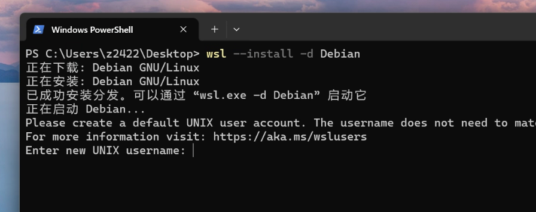
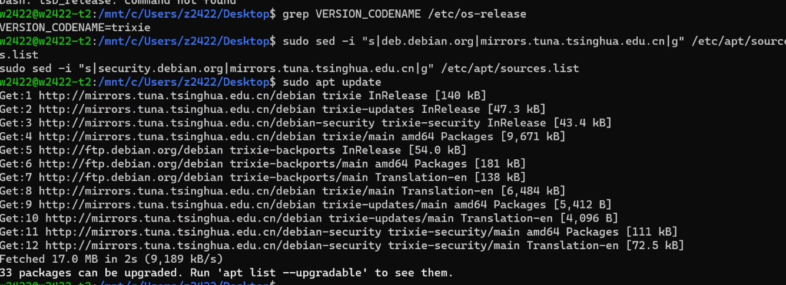
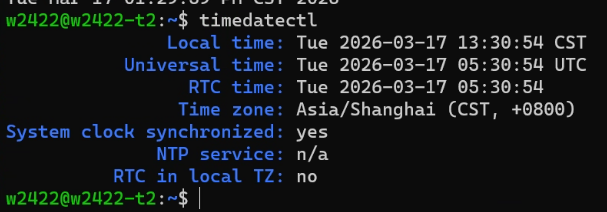
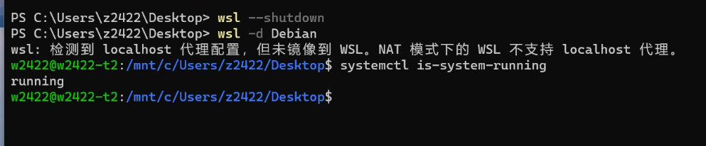
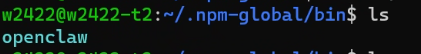
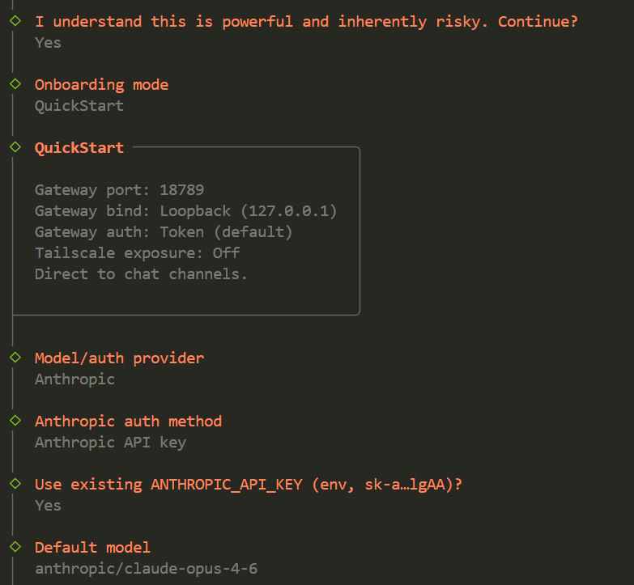
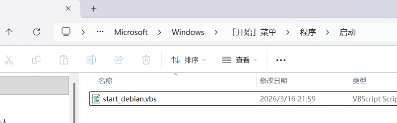
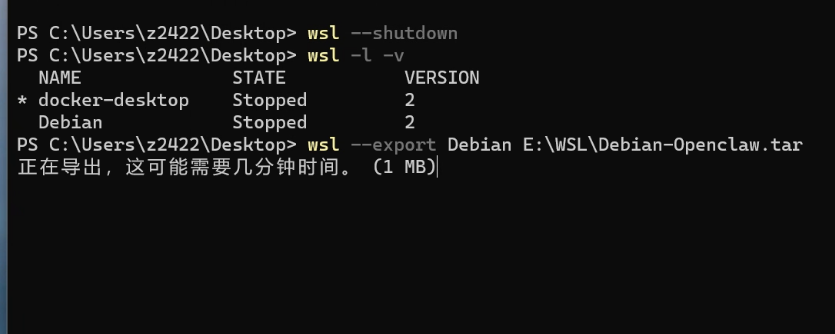

<!--more-->

## wsl2安装openclaw教程

记录下如何wsl2 安装openclaw(小龙虾)，并分享下几个容易踩坑的点。

### 1）安装wsl和镜像

1）安装wsl2

Win + X → 选择 Windows 终端 (管理员)

```undefined
wsl --install
```

该命令会会自动完成WSL2安装

2）设置默认 WSL 版本

```undefined
#设置版本
wsl --set-default-version 2
#查看wsl版本
wsl --version
```

3）wsl2 安装Debian镜像

可以去 Microsoft Store 搜索 Debian 安装，也可以使用Powershell输入下列命令安装

```undefined
wsl --install -d Debian
```

安装完成后打开 Debian，按提示设置：

- 用户名（自定义，如 debian）
- 密码（输入时不显示，正常输入即可）



### 2）镜像初始化操作

1）更换国内源

1. 备份原始源文件

   ```undefined
   #查看版本
   grep VERSION_CODENAME /etc/os-release
   #备份源
   sudo cp /etc/apt/sources.list /etc/apt/sources.list.bak
   ```

2. 替换apt下载源

   ```undefined
   #替换为清华源
   sudo sed -i "s|deb.debian.org|mirrors.tuna.tsinghua.edu.cn|g" /etc/apt/sources.list
   sudo sed -i "s|security.debian.org|mirrors.tuna.tsinghua.edu.cn|g" /etc/apt/sources.list
   ```

3. 更新

   ```powershell
   sudo apt update && sudo apt upgrade -y
   ```

   

2）补全最小化镜像的缺少的依赖(常用软件) 【坑点①】

```undefined
# 安装常用必备软件
sudo apt install -y \
curl wget git vim htop net-tools iputils-ping dnsutils \
build-essential python3 python3-pip nodejs npm \
zip unzip tar lsof rsync openssh-server ca-certificates polkitd pkexec

# 中文支持（可选）
sudo apt install -y locales
sudo locale-gen zh_CN.UTF-8
```

3）调整时间

```powershell
#查看当前系统时间是否与你所在时区匹配，若匹配则不用修改
timedatectl 
#调整时间
sudo dpkg-reconfigure tzdata
```



4）开启systemd

wsl默认是关闭systemd，需要先开启后才能安装openclaw gateway 【坑点②】

```undefined
sudo tee /etc/wsl.conf > /dev/null << EOF
[boot]
systemd=true

[network]
generateHosts = true
generateResolvConf = true

EOF
```

回到宿主机，打开powershell，输入下属命令让WSL重启生效

```undefined
wsl --shutdown
wsl -d Debian
```

验证 systemd 是否开启

```undefined
systemctl is-system-running
```



5）开启 SSH 开机自启

```undefined
sudo systemctl enable --now ssh
```

6）清理无用项

```undefined
sudo apt autoremove -y && sudo apt clean
```

7）配置代理 【坑点③】

```undefined
cat >> ~/.bashrc << 'EOF'

# ========== WSL 自动代理配置（自动获取Windows主机IP）==========
# 获取 Windows 主机IP
export hostip=$(ip route | grep default | awk '{print $3}')
# 你的代理端口（根据你的软件修改 Clash默认7890 V2RayN 10808或10809）
export proxy_port=10810

# 开启代理
function proxy_on() {
    export http_proxy="http://$hostip:$proxy_port"
    export https_proxy="http://$hostip:$proxy_port"
    export no_proxy="localhost,127.0.0.1,::1,localaddress,.localdomain.com"
    echo -e "\033[32m[√] 代理已开启：http://$hostip:$proxy_port\033[0m"
}

# 关闭代理
function proxy_off() {
    unset http_proxy https_proxy no_proxy
    echo -e "\033[31m[×] 代理已关闭\033[0m"
}

# 快捷命令
alias proxy='proxy_on'
alias unproxy='proxy_off'

EOF
```

刷新使上述设置生效

```undefined
source ~/.bashrc
```

### 3）Openclaw安装

一键安装：

```undefined
sudo curl -fsSL https://openclaw.ai/install.sh | bash
```

> Tips：安装完成后，若在终端输入openclaw提示 -bash: openclaw: command not found 解决方法 【坑点④】

- 原因：npm 全局 bin 目录未加入 PATH

- 解决方案 

  - \#查看openclaw是否安装上

    ```undefined
    cd ~/.npm-global/bin/
    ```

    

  - npm加入Path

    ```undefined
    # 1. 追加路径到 .profile
    echo 'export PATH="/home/你创建的用户/.npm-global/bin:$PATH"' >> ~/.profile
    
    # 2. 立即生效
    source ~/.profile
    
    # 3. 验证
    openclaw
    ```


新手引导并安装服务

```undefined
openclaw onboard --install-daemon
```

跟着提示操作即可



<center>（图片仅供参考,请结合实际选择)</center>


检查网关服务是否已启动

```undefined
systemctl --user status openclaw-gateway
```

检查网关是否是开机自启

```undefined
#检查
systemctl --user is-enabled openclaw-gateway

#若不是enabled请使用下属命令自行设置
systemctl --user enable openclaw-gateway
```

验证一切是否正常工作：

```undefined
openclaw doctor         # 检查配置问题
openclaw status         # Gateway 网关状态
openclaw dashboard      # 打开浏览器 UI
```

### 4）WSL设置开机自启动

Win+R 输入 shell:startup 打开 开机程序自启动 文件夹

在里面新建start_wsl_debian.vbs文件 内容如下：

```undefined
Set ws = CreateObject("WScript.Shell")
'后台静默启动 Debian
ws.run "wsl -d Debian", 0
ws.run "wsl -d Debian -u root /etc/init.wsl", 0
```



设置完毕后 重启试验下，看看wsl会不会在后台静默启动，以及你小龙虾是否以及在线了。


### 5）移动Debian镜像至其他盘

​	这一步是可选操作，如果C盘够大或者无该需求，到此就可以。

​	若有将小龙虾从C移动到其他盘的小伙伴，可以跟着下述操作步骤，这样能释放C盘空间，解放C盘不富裕的小伙伴。

操作步骤：

1. 导出 Debian 为备份文件

   ```undefined
   #关闭所有 WSL 实例
   wsl --shutdown
   #查看WSL实例状态
   wsl -l -v
   #导出
   wsl --export Debian E:\WSL\Debian-Openclaw.tar
   ```

   

2. 注销 C 盘原 Debian（释放空间）

   ```undefined
   wsl --unregister Debian
   wsl -l -v
   ```

3. 导入到目标盘（D 盘）

   ```undefined
   # 语法：wsl --import <发行版名> <安装目录> <备份文件> --version 2
   wsl --import Debian E:\WSL\Debian E:\WSL\Debian-Openclaw.tar --version 2
   ```

4. 恢复默认用户【坑点⑤】

   ```undefined
   # 进入 Debian
   wsl -d Debian
   
   # 查看你的用户名（如 w2xxx）
   cat /etc/passwd | grep 1000
   
   # 设置默认用户（退出后生效）
   sudo tee /etc/wsl.conf > /dev/null << EOF
   [user]
   default=你创建的(普通)用户名
   
   [boot]
   systemd=true
   
   [network]
   generateHosts = true
   generateResolvConf = true
   EOF
   ```

5. 验证与清理

   ```undefined
   #关机
   wsl --shutdown
   
   # 启动 Debian，检查是否正常
   wsl -d Debian
   
   # 验证安装位置（在 Debian 内）
   df -h /
   
   # 清理备份文件（可选）
   rm D:\WSL\Debian-backup.tar
   ```


### 6）卸载

​	因为我们的小龙虾是安在wsl上面的，所以想要卸载的话直接删除wsl启动的镜像就行了

```undefined
#查看
wsl --list
#暂停
wsl --stop
#卸载
wsl --unregister Debian
```

<br>

---


