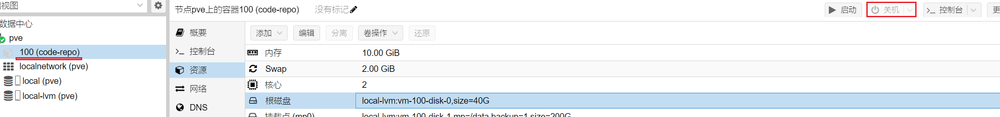
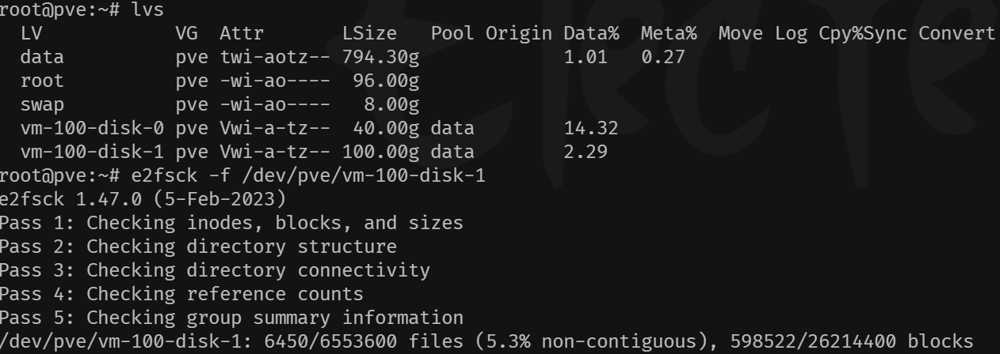
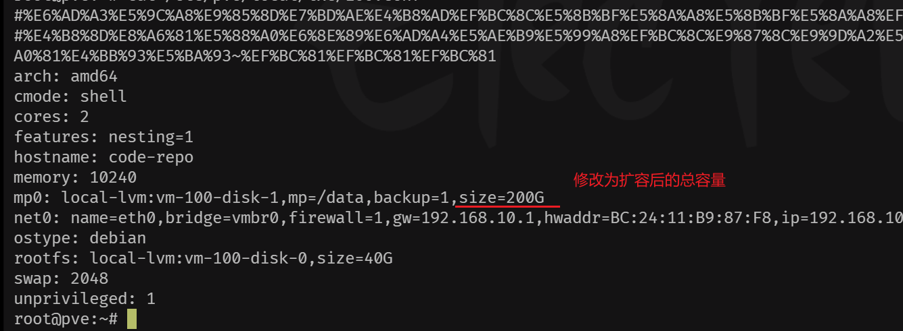
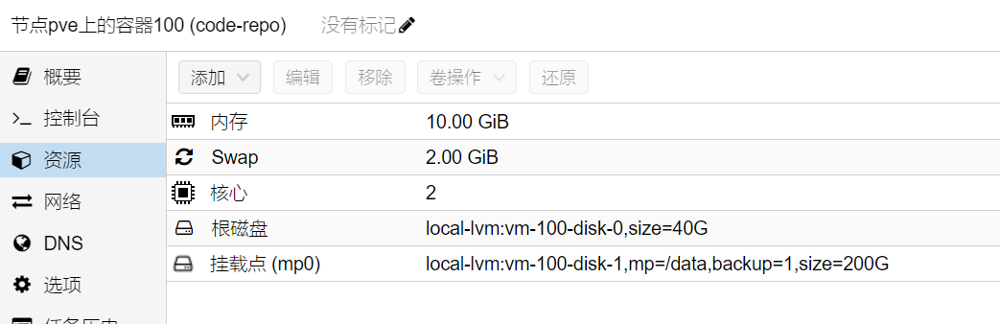
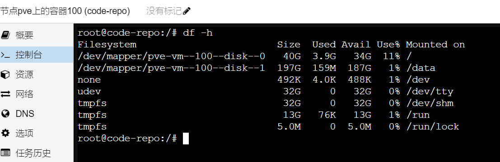

<!--more-->

**PVE系列-LXC容器磁盘扩容**

以下内容是记录LXC容器磁盘如何进行扩容操作

 首先，选中要进行磁盘扩容的容器，停止它



 打开`shell`终端，检查要扩容逻辑卷是否有问题，笔者这里是vm-100-disk-1



```sh
# 查看内部逻辑卷的输出信息 
lvs 
#e2fsck检查该逻辑卷有无问题 
e2fsck -f /dev/pve/vm-100-disk-1
```

 没有问题的话，执行逻辑卷扩容操作

```sh
# 为逻辑卷增加100G容量 
lvextend -L +100G /dev/pve/vm-100-disk-0
```

 逻辑卷扩容完毕后，我们需要修改容器配置信息。若不修改，页面上显示的还是100G



```sh
vim /etc/pve/local/lxc/100.conf
```

 修改完毕后，并没有完成扩容操作，我们还需要进行实际扩容工作。

```sh
#使用resize2fs进行实际容量扩容 resize2fs /dev/pve/vm-100-disk-1 200G
```

 注意这里200G是增加后的总容量。

 完成后，进入PVE启动容器，查看是否扩容完成。





Done~~完成收工~
