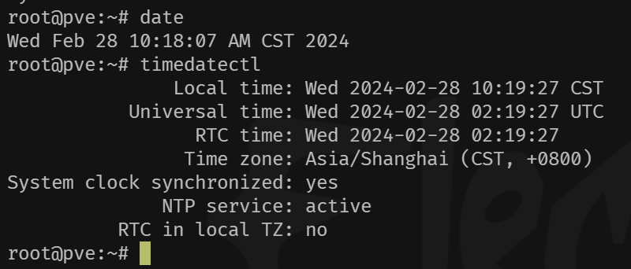
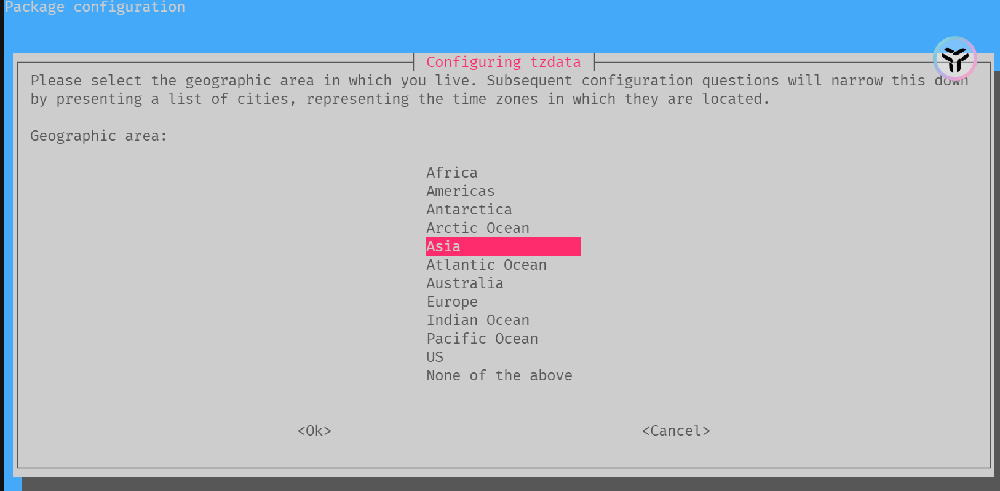
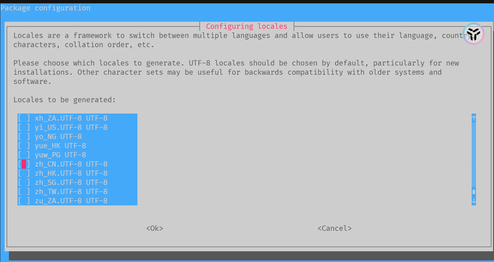
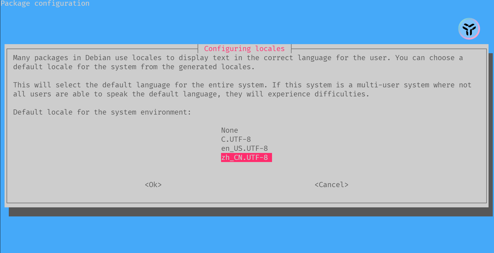

<!--more-->

## PVE系列-初始化设置

### 更新时区

 首先使用`data` 和`timedatectl` 指令查看当前系统时间是否与你所在时区匹配，若匹配则不用修改。



 若不匹配则使用`dpkg-reconfigure` 指令修改时区。

```sh
dpkg-reconfigure tzdata
```

 选择Asia即可



### 语言设置

 修改系统默认语言为中文

```sh
dpkg-reconfigure locales
```

 选择`zh_CN.UTF-8 UTF-8` (确认选定按下空格)



 确认选择`zh_CN.UTF-8 UTF-8`



### 硬件信息展示

 使用下属脚本完成在PVE页码上展示cpu、[磁盘](https://www.smzdm.com/ju/s2441lm/)等温度、频率、功率等信息

```sh
wget -c https://raw.githubusercontent.com/a904055262/PVE-manager-status/main/showtempcpufreq.sh && chmod +x showtempcpufreq.sh && ./showtempcpufreq.sh
```


### 软件源更换

 参考[《PVE更换软件&LXC容器源》](https://www.gvnote.com/posts/replace-lxc-container-source)

### 开启远程登录

 输入以下内容，允许终端登录，若有防火墙需要配置下防火墙规则，开放22端口。

```sh
#开启root登录 
sed -i '/PermitRootLogin/ a PermitRootLogin yes' /etc/ssh/sshd_config 
#重启ssh服务,让配置生效 
systemctrl restart sshd
```
