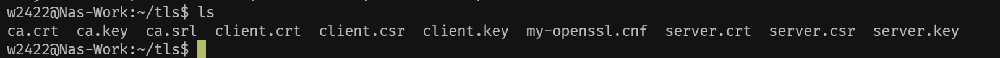
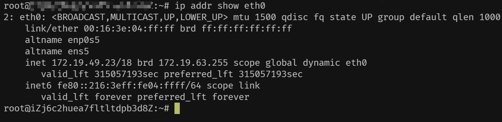
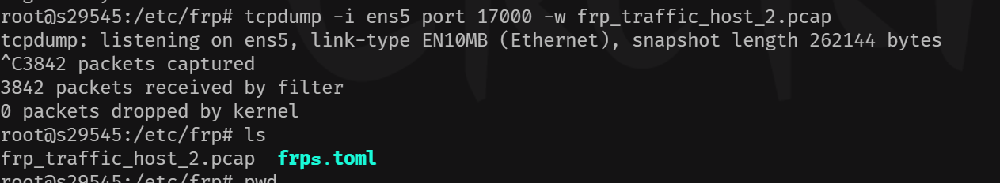
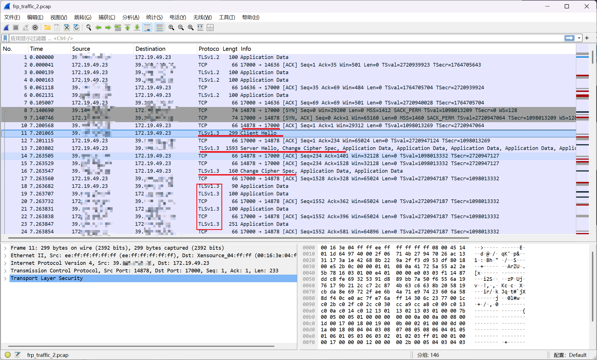
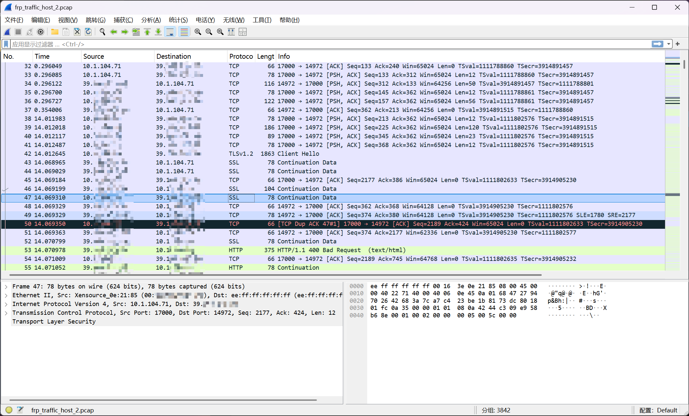
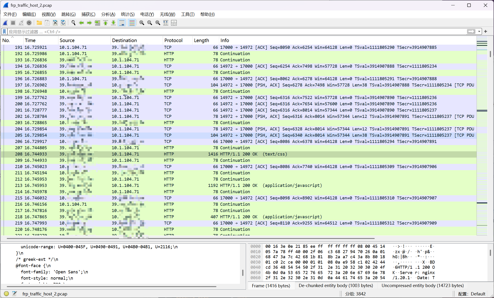

# FRP配置TLS双向加密连接


&lt;!--more--&gt;


记录一下frp如何配置TLS双向加密，以防后面忘记如何配置。

建立任意一个文件夹，在文件夹下创建`my-openssl.cnf`文件，并写入一下配置：

```ini
[ ca ]
default_ca = CA_default
[ CA_default ]
x509_extensions = usr_cert
[ req ]
default_bits        = 2048
default_md          = sha256
default_keyfile     = privkey.pem
distinguished_name  = req_distinguished_name
attributes          = req_attributes
x509_extensions     = v3_ca
string_mask         = utf8only
[ req_distinguished_name ]
[ req_attributes ]
[ usr_cert ]
basicConstraints       = CA:FALSE
nsComment              = &#34;OpenSSL Generated Certificate&#34;
subjectKeyIdentifier   = hash
authorityKeyIdentifier = keyid,issuer
[ v3_ca ]
subjectKeyIdentifier   = hash
authorityKeyIdentifier = keyid:always,issuer
basicConstraints       = CA:true
```

生成默认 ca:

```bash
openssl genrsa -out ca.key 2048 #生成长度为2048位的RSA私钥文件
openssl req -x509 -new -nodes -key ca.key -subj &#34;/CN=example.ca.com&#34; -days 3650 -out ca.crt #使用私钥文件(ca.key)生成自签名证书,有效期为10年

#也可以使用替代下述替代,会提示输入 Country Name、Organization Name 等
openssl req -x509 -new -nodes -key ca.key -days 3650 -out ca.crt
```


生成服务端证书:

```bash
openssl genrsa -out server.key 2048 #服务端证书

#生成服务端证书签名请求
openssl req -new -sha256 -key server.key \
    -subj &#34;/C=XX/ST=DEFAULT/L=DEFAULT/O=DEFAULT/CN=server.com&#34; \
    -reqexts SAN \
    -config &lt;(cat my-openssl.cnf &lt;(printf &#34;\n[SAN]\nsubjectAltName=DNS:localhost,IP:FRP服务端公网ip,DNS:example.server.com&#34;)) \
    -out server.csr 

#使用CA跟证书和私钥对csr进行签名，签发服务端证书,有效期365天
openssl x509 -req -days 365 -sha256 \
	-in server.csr -CA ca.crt -CAkey ca.key -CAcreateserial \
	-extfile &lt;(printf &#34;subjectAltName=DNS:localhost,IP:FRP服务端公网ip地址,DNS:example.server.com&#34;) \
	-out server.crt
```

&gt; Tips:
&gt;
&gt; ​	1、 -subj &#34;/C=XX/ST=DEFAULT/L=DEFAULT/O=DEFAULT/CN=server.com&#34; 指的是证书的证书持有者的身份信息，可以根据实际情况替换吗，这里使用默认DEFAULT
&gt;
&gt; 	/CN国家代码 /ST省份 /L城市 /O 组织名称 /CN通用名称
&gt;
&gt; ```ini
&gt; #示例
&gt; -subj &#34;/C=CN/ST=Beijing/O=\&#34;My Company, Ltd\&#34;/CN=app.example.com&#34;
&gt; ```
&gt;
&gt; ​	2、config参数结合实际填写，这里SAN字段是自签名校验证书是否有效的关键配置
&gt;
&gt; ```sh
&gt; -config &lt;(cat my-openssl.cnf &lt;(printf &#34;\n[SAN]\nsubjectAltName=DNS:localhost,IP:127.0.0.1,DNS:example.server.com&#34;))
&gt; ```
&gt;
&gt; ​	SAN(subjectAltName)字段后面跟的DNS和IP是指该证书(记录)允许的域名或IP。
&gt;
&gt; ​	e.g:  SAN=DNS:a.com,DNS:b.com IP:192.168.1.12
&gt;
&gt; ​		访问域名 a.com  san条目 a.com  匹配      结果 成功-&gt;安全
&gt;
&gt; ​		访问域名 c.com  san条目 a.com  不匹配   结果 失败-&gt;不安全
&gt;
&gt; ​		访问域名 192.168.1.12  san条目 192.168.1.12  结果 成功-&gt;安全
&gt;
&gt; ​	在这里**客户端验证服务端证书时，检验的是①证书是否由可信的 CA 签发；② 客户端要实际连接的域名或 IP是否在证书的SAN中**，若不在会拒绝链接。


生成客户端证书：

```bash
openssl genrsa -out client.key 2048

#生成客户端证书签名请求
openssl req -new -sha256 -key client.key \
    -subj &#34;/C=XX/ST=DEFAULT/L=DEFAULT/O=DEFAULT/CN=client.com&#34; \
    -reqexts SAN \
    -config &lt;(cat my-openssl.cnf &lt;(printf &#34;\n[SAN]\nsubjectAltName=DNS:client.com,DNS:example.client.com&#34;)) \
    -out client.csr
    
#使用CA跟证书和私钥对csr进行签名，签发客户端证书,有效期365天
openssl x509 -req -days 365 -sha256 \
    -in client.csr -CA ca.crt -CAkey ca.key -CAcreateserial \
	-extfile &lt;(printf &#34;subjectAltName=DNS:client.com,DNS:example.client.com&#34;) \
	-out client.crt
```

&gt; Tips:
&gt;
&gt; ​	Q：服务端SAN字段与客户端SAN字段不一致，服务端是如何校验客户端证书的？
&gt;
&gt; ​	A：双向TLS中，服务端验证的重点是签发CA和用途，客户端证书是否有可信CA(ca.crt)签发 客户端证书扩展用途。除非服务端明确指定客户端的SAN，否则无强制要求。


生成完毕后，结果应该如下图所示：



有了上述文件后，接下来着手修改frps和frpc的配置：

frps: (示例)

```bash
bindPort = 17000
#Auth
auth.method = &#34;token&#34;
auth.token = &#34;fxxxxxxxxxxx86&#34;

#TLS
transport.tls.force = true
transport.tls.certFile = &#34;/etc/frps/server.crt&#34;
transport.tls.keyFile = &#34;/etc/frps/server.key&#34;
transport.tls.trustedCaFile = &#34;/etc/frps/ca.crt&#34;

#Log
log.to = &#34;/var/log/frp/frps.log&#34;
log.level = &#34;debug&#34;
log.maxDays = 7
```

frpc: (示例)

```bash
serverAddr = &#34;x.x.x.x&#34;
serverPort = 17000

auth.method = &#34;token&#34;
auth.token = &#34;fxxxxxxxxxxx86&#34;

#tls配置
transport.tls.enable = true
transport.tls.certFile = &#34;/etc/frp/certificate/client.crt&#34;
transport.tls.keyFile = &#34;/etc/frp/certificate/client.key&#34;
transport.tls.trustedCaFile = &#34;/etc/frp/certificate/ca.crt&#34;
log.level = &#34;debug&#34;

[[proxies]]
name = &#34;abc&#34;
type = &#34;tcp&#34;
localIP = &#34;127.0.0.1&#34;
localPort = 8088
remotePort = 8080

```

修改完毕后，重启frps和frpc使其生效。至此，客户端和服务端的双向验证配置完毕。


----


接下来就是抓包看下是否生效：

​	1、记录下当前frps ip地址



​	2、使用tcpdump捕获17000端口流量

```bash
tcpdump -i eth0 port 17000 -w frp_traffic_17000.pcap
```



(上图)

​	3、将pcap数据包导入wireshark看是否生效




贴两张没配置TLS的图与之对比：







---

> Author: [w2422](https://www.gvnote.com)  
> URL: https://www.gvnote.com/posts/frp-configuration-for-mutual-tls-encrypted/  

