# 使用Clion配置Ardunio开发环境


&lt;!--more--&gt;

### 安装Python环境

官网下载https://www.python.org/downloads/ 安装包并进行安装。

验证Python是否安装成功

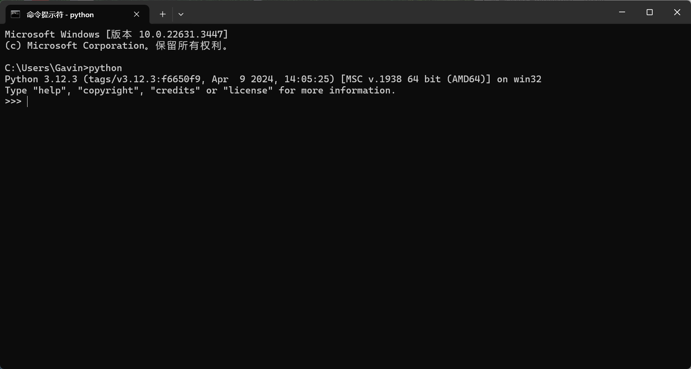

### 安装PlatFormIO(core)

点击下载脚本

[get-platformio.py](https://raw.githubusercontent.com/platformio/platformio-core-installer/master/get-platformio.py)

下载脚本后，在Cmd命令行里执行

```bash
python get-platformio.py
```

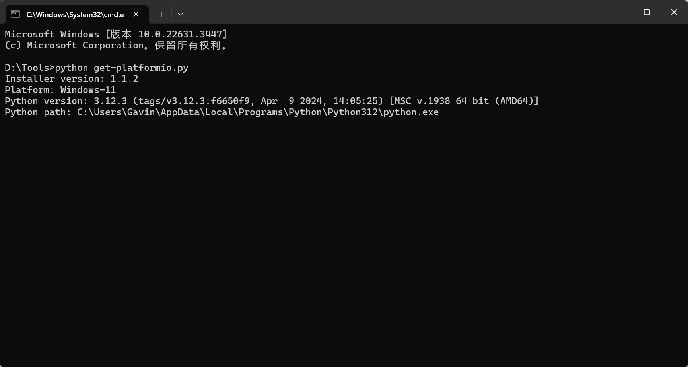

等待安装下载完成

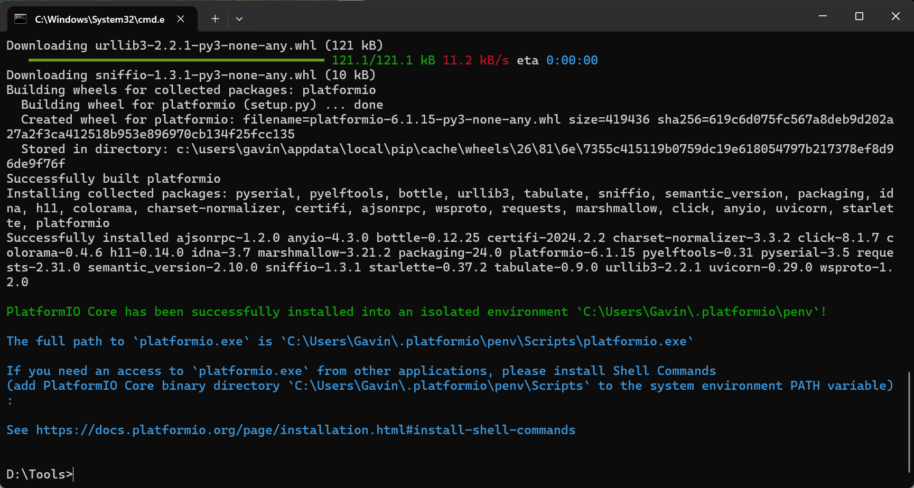


### PlatformIO安装验证

1. 设置`C:\Users\Gavin\.platformio\penv\Scripts`文件夹到环境变量Path中

   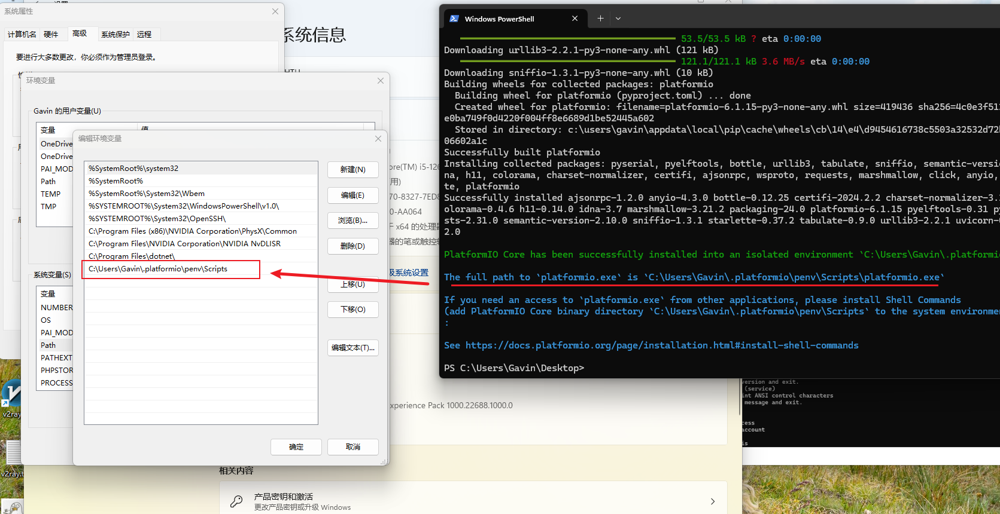

   &gt; tips
   &gt;
   &gt; ​	如果添加后在第二部验证无效果，请删除path环境变量重新添加即可。

2. 输入pio验证platform安装是否成功

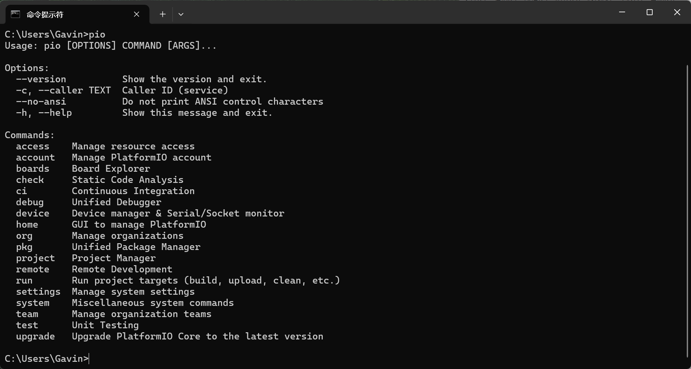


### CLion插件配置

1. Market搜索PlatformIO for Clion并安装，安装完成后重启CLion

   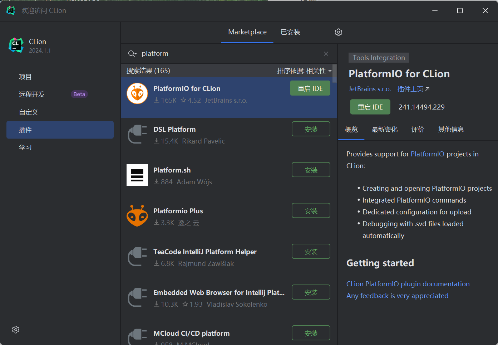

2. 新建项目--&gt;PlatformIO--&gt;输入 `arduino uno`

   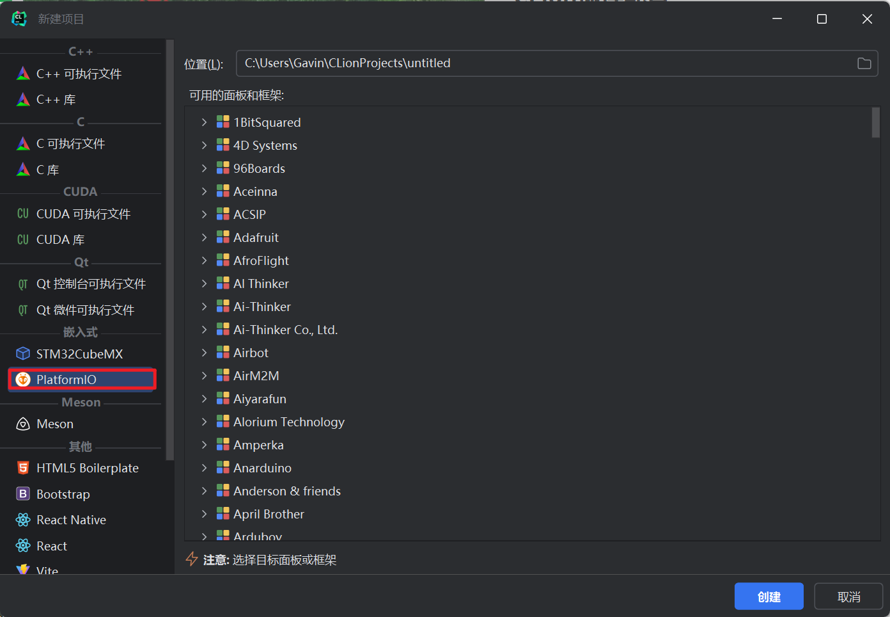

3. 创建项目

   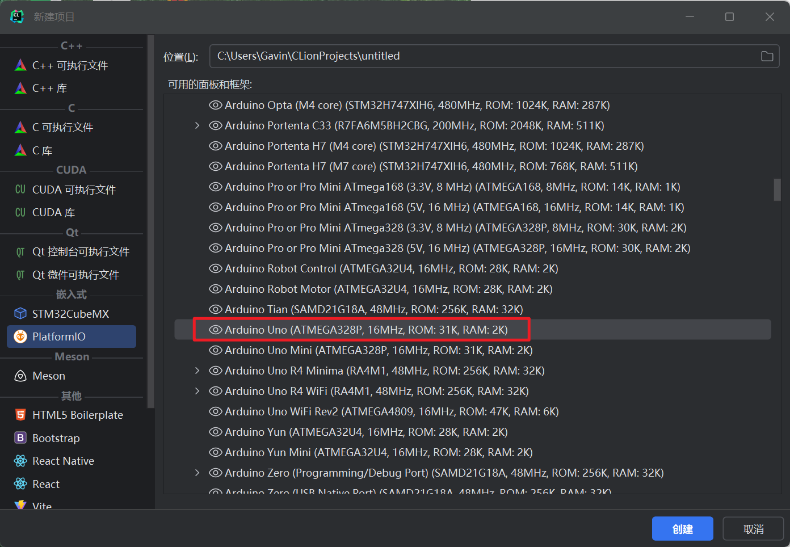

4. 等待platformIO-core创建的项目初始化完毕

   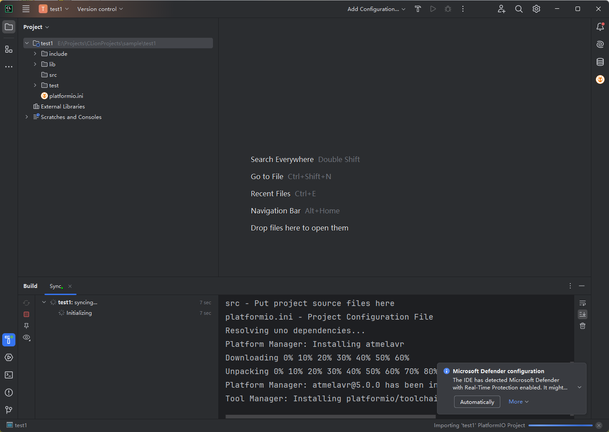

5. 验证是否按照成功

   1. 接上Ardunio Uno开发板

   2. 随意编写一段程序通过CLion上传，观察控制台输出。

      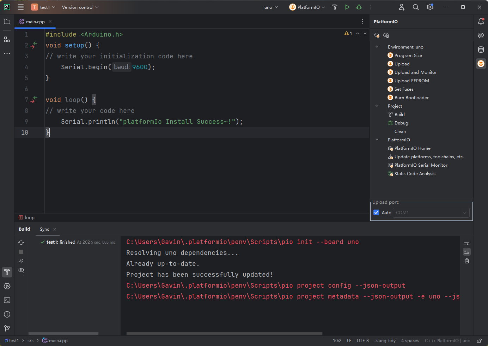

      点击上方的绿色小三角，等待编译烧录完成。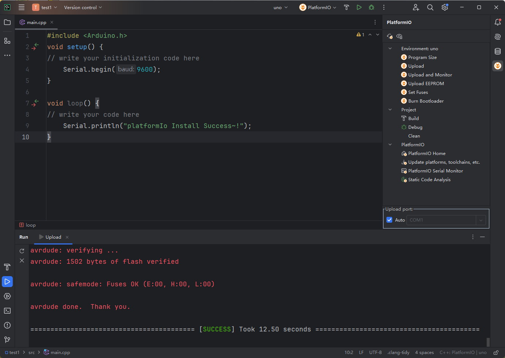

   3. 查看输出结果

      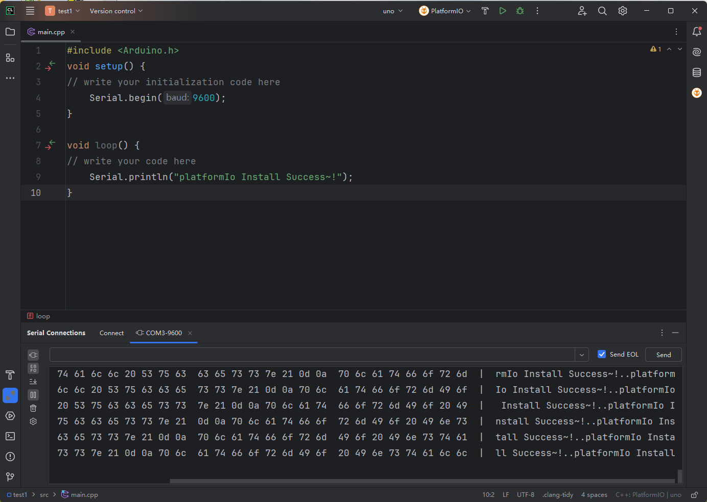

​	OK，上述就是如何使用CLion配置Ardunio开发环境。

​	End


---

> Author: [w2422](https://www.gvnote.com)  
> URL: https://www.gvnote.com/posts/platform-thrid-ide-installation/  

