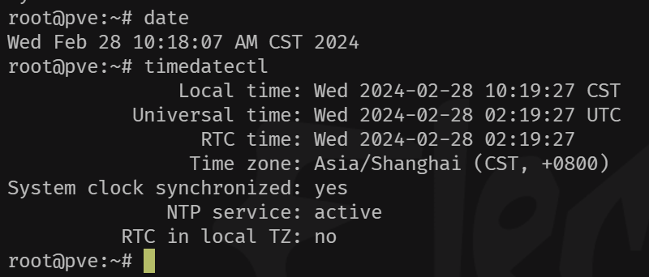
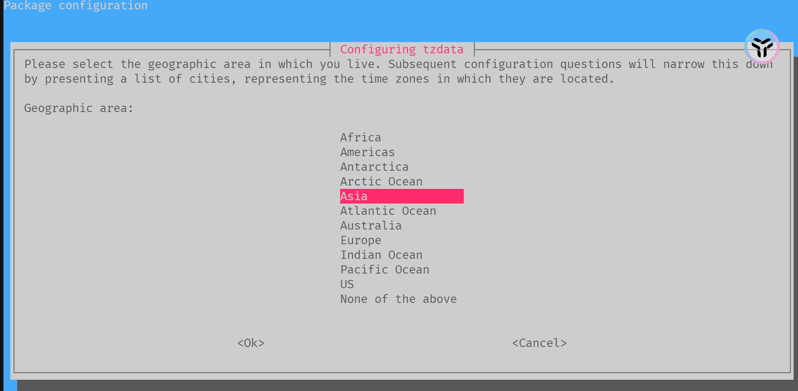
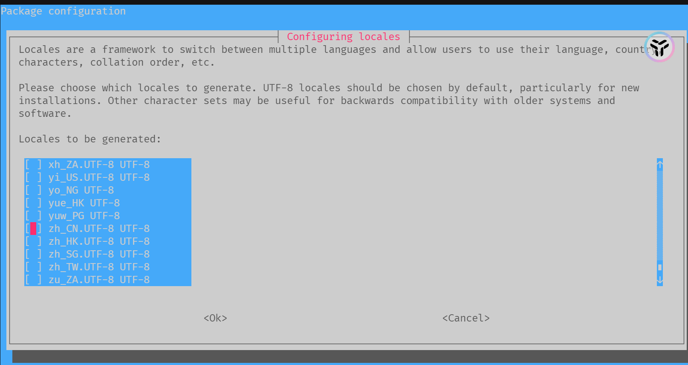
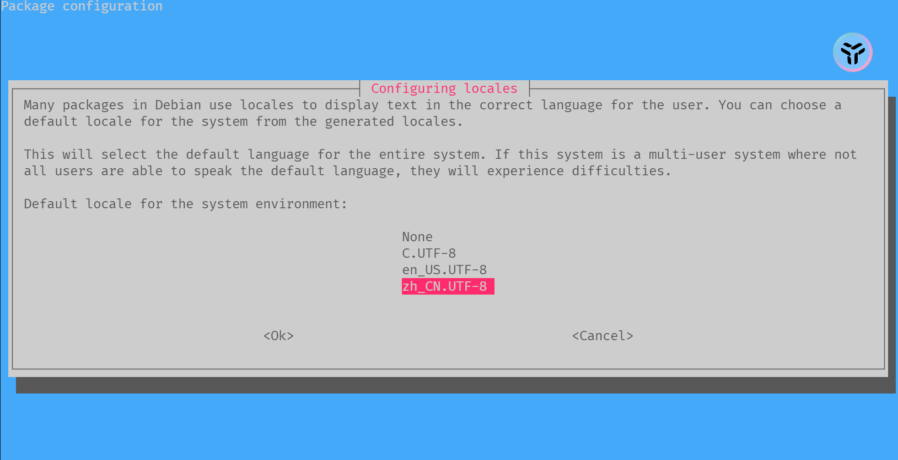

# PVE系列-初始化设置


&lt;!--more--&gt;

# PVE系列-初始化设置

### 更新时区

​	首先使用`data` 和`timedatectl` 指令查看当前系统时间是否与你所在时区匹配，若匹配则不用修改。



​	若不匹配则使用`dpkg-reconfigure` 指令修改时区。

```bash
dpkg-reconfigure tzdata  
```

​	选择Asia即可



### 语言设置

​	修改系统默认语言为中文

```bash
dpkg-reconfigure locales  
```

​	选择`zh_CN.UTF-8 UTF-8` (确认选定按下空格)



​	确认选择`zh_CN.UTF-8 UTF-8`



### 硬件信息展示

​	使用下属脚本完成在PVE页码上展示cpu、[磁盘](https://www.smzdm.com/ju/s2441lm/)等温度、频率、功率等信息

```bash
wget -c https://raw.githubusercontent.com/a904055262/PVE-manager-status/main/showtempcpufreq.sh &amp;&amp; chmod &#43;x showtempcpufreq.sh &amp;&amp; ./showtempcpufreq.sh
```


### 软件源更换

​	参考[《PVE更换软件&amp;LXC容器源》](https://www.gvnote.com/posts/replace-lxc-container-source)


### 开启远程登录

​	输入以下内容，允许终端登录，若有防火墙需要配置下防火墙规则，开放22端口。

```bash
#开启root登录
sed -i &#39;/PermitRootLogin/ a PermitRootLogin yes&#39; /etc/ssh/sshd_config
#重启ssh服务,让配置生效
systemctrl restart sshd	
```


---

> Author: [w2422](https://www.gvnote.com)  
> URL: https://www.gvnote.com/posts/pve-initialization-guide/  

