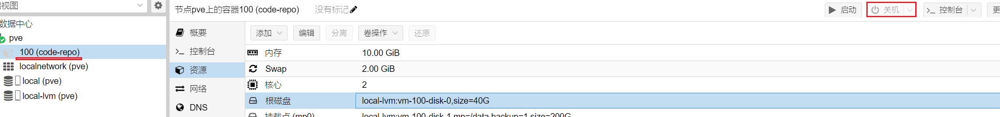
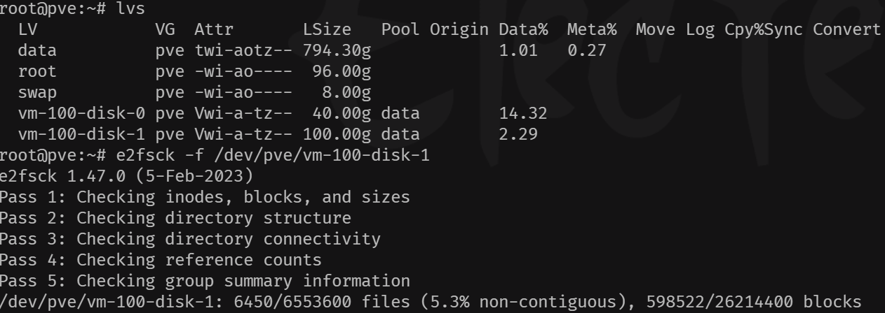
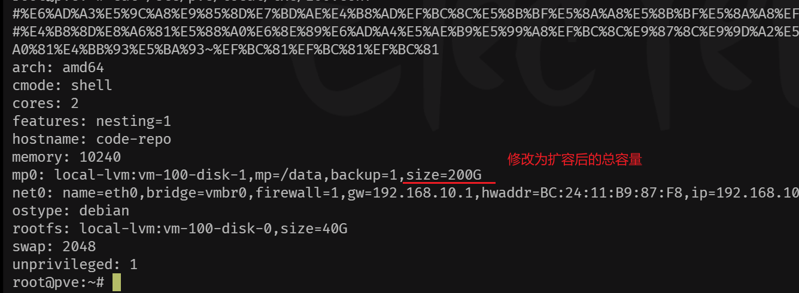
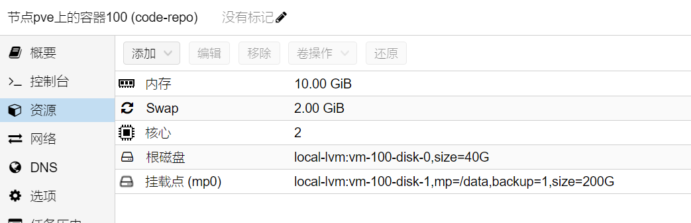
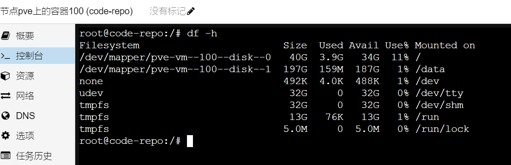

# PVE系列-LXC容器磁盘扩容


&lt;!--more--&gt;

以下内容是记录LXC容器磁盘如何进行扩容操作

​	首先，选中要进行磁盘扩容的容器，停止它



​	打开`shell`终端，检查要扩容逻辑卷是否有问题，笔者这里是vm-100-disk-1



```bash
# 查看内部逻辑卷的输出信息
lvs
#e2fsck检查该逻辑卷有无问题
e2fsck -f /dev/pve/vm-100-disk-1
```

​	没有问题的话，执行逻辑卷扩容操作

```bash
# 为逻辑卷增加100G容量
lvextend -L &#43;100G /dev/pve/vm-100-disk-0
```

​	逻辑卷扩容完毕后，我们需要修改容器配置信息。若不修改，页面上显示的还是100G



```bash
vim /etc/pve/local/lxc/100.conf
```

​	修改完毕后，并没有完成扩容操作，我们还需要进行实际扩容工作。

```bash
#使用resize2fs进行实际容量扩容
resize2fs /dev/pve/vm-100-disk-1 200G
```

​	注意这里200G是增加后的总容量。

​	完成后，进入PVE启动容器，查看是否扩容完成。





​	Done~


---

> Author: [w2422](https://www.gvnote.com)  
> URL: https://www.gvnote.com/posts/pve-lxc-container-disk-grow/  

