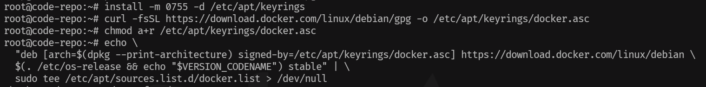

# PVE系列-初始化LXC容器并安装Docker


&lt;!--more--&gt;


### 模板下载

​	下载模板前请务必确保已经替换过LXC源，若还未替换可参考[《PVE系列-更换软件&amp;容器源》](https://www.gvnote.com/posts/replace-lxc-container-source)进行更换LXC源操作。

​	在PVE后台页面选择 `local(pve)` -&gt; `CT模板` -&gt; `模板` 选择对应镜像下载。这里以debian12为例：

&lt;img src=&#34;./assets/image-20240228104504044-1741313025781-1-1741333679444-1.png&#34; alt=&#34;image-20240228104504044&#34; style=&#34;zoom:80%;&#34; /&gt;

​	点击下载并等待下载完成。

&lt;img src=&#34;./assets/image-20240228105502754-1741313025781-2-1741333679444-4.png&#34; alt=&#34;image-20240228105502754&#34; style=&#34;zoom:80%;&#34; /&gt;

### 创建LXC容器

​	点击右上方`创建CT` 来创建LXC容器

&lt;img src=&#34;./assets/image-20240228105640475-1741313025781-3-1741333679444-7.png&#34; alt=&#34;image-20240228105640475&#34; style=&#34;zoom:80%;&#34; /&gt;

​	勾选`无特权的容器` 选项并填写配置信息

&lt;img src=&#34;./assets/image-20240228110312699-1741313025781-4-1741333679444-2.png&#34; alt=&#34;image-20240228110312699&#34; style=&#34;zoom:80%;&#34; /&gt;

​	模板选择刚下载好的debian12

&lt;img src=&#34;./assets/image-20240228110454078-1741313025781-5-1741333679444-9.png&#34; alt=&#34;image-20240228110454078&#34; style=&#34;zoom:80%;&#34; /&gt;

​	根据实际需要划分磁盘大小，笔者这边有存储需要，因此新增了一块存储磁盘

&lt;img src=&#34;./assets/image-20240228112447781-1741313025781-7-1741333679444-3.png&#34; alt=&#34;image-20240228112447781&#34; style=&#34;zoom:80%;&#34; /&gt;

&lt;img src=&#34;./assets/image-20240228112539337-1741313025781-6-1741333679444-5.png&#34; alt=&#34;image-20240228112539337&#34; style=&#34;zoom:80%;&#34; /&gt;

​	CPU和内存分配根据实际需求划分即可。这边以运行gitlab为例，2C8G200G。

​	网络配置

&lt;img src=&#34;./assets/image-20240228112646165-1741313025781-8-1741333679444-6.png&#34; alt=&#34;image-20240228112646165&#34; style=&#34;zoom:80%;&#34; /&gt;

​	若ipv6获取不到地址，切换为SLAAC尝试下	 

​	DNS保持默认即可

&lt;img src=&#34;./assets/image-20240228112729055-1741313025781-9-1741333679444-8.png&#34; alt=&#34;image-20240228112729055&#34; style=&#34;zoom:80%;&#34; /&gt;

​	等待创建完成

&lt;img src=&#34;./assets/image-20240228112805860-1741313025781-10-1741333679444-10.png&#34; alt=&#34;image-20240228112805860&#34; style=&#34;zoom:80%;&#34; /&gt;

### 启动LXC容器

​	创建完成后，来到选项`控制台模式` 调整为` shell` ，否则启动后是黑屏状态。&lt;img src=&#34;./assets/image-20240228145000182-1741313025781-11-1741333679444-11.png&#34; alt=&#34;image-20240228145000182&#34; style=&#34;zoom:80%;&#34; /&gt;

 	调整为shell后再点击启动。

&lt;img src=&#34;./assets/image-20240228143836850-1741313025781-12-1741333679444-12.png&#34; alt=&#34;image-20240228143836850&#34; style=&#34;zoom:80%;&#34; /&gt;

​	点开控制台，开启远程链接。

&lt;img src=&#34;./assets/image-20240228145421247-1741313025781-13-1741333679444-13.png&#34; alt=&#34;image-20240228145421247&#34; style=&#34;zoom:80%;&#34; /&gt;

```bash
#允许远程登录
sed -i &#39;/PermitRootLogin/ a PermitRootLogin yes&#39; /etc/ssh/sshd_config

#重启ssh服务
systemctl restart sshd
```

​	ok，使用`ssh终端`测试能否链接上

&lt;img src=&#34;./assets/image-20240228145833603-1741313025781-14-1741333679444-14.png&#34; alt=&#34;image-20240228145833603&#34; style=&#34;zoom:80%;&#34; /&gt;

#### 初始化配置

**时区**

```bash
dpkg-reconfigure tzdata
```

&lt;img src=&#34;./assets/image-20240228150243234-1741313025781-15-1741333679444-15.png&#34; alt=&#34;image-20240228150243234&#34; style=&#34;zoom:80%;&#34; /&gt;

**语言**

```bash
dpkg-reconfigure locales
```

&lt;img src=&#34;./assets/image-20240228150329403-1741313025781-16-1741333679444-16.png&#34; alt=&#34;image-20240228150329403&#34; style=&#34;zoom:67%;&#34; /&gt;

**软件源更换**

​	由于模板并未预装 curl，所以我们需要手动安装下

```bash
apt update
apt install curl
```

&lt;img src=&#34;./assets/image-20240228150717838-1741313025781-17-1741333679444-17.png&#34; alt=&#34;image-20240228150717838&#34; style=&#34;zoom:80%;&#34; /&gt;	

​	完成之后再执行下属命令

```bash
bash &lt;(curl -sSL https://linuxmirrors.cn/main.sh)
```

&lt;img src=&#34;./assets/image-20240228150829822-1741313025781-18-1741333679445-19.png&#34; alt=&#34;image-20240228150829822&#34; style=&#34;zoom:80%;&#34; /&gt;


### 核显配置

​	如果你创建的LXC容器不需要使用核显的话，这一部分可以跳过。

​	【注意】下述操作需要在**宿主机**操作

​	使用命令`ls -l /dev/dri` 查询硬件信息

&lt;img src=&#34;./assets/image-20240228153102606-1741313025781-19-1741333679445-18.png&#34; alt=&#34;image-20240228153102606&#34; style=&#34;zoom:80%;&#34; /&gt;

​	这里的226,0和226,128是主次设备号

​	编辑配置文件`/etc/pve/lxc/容器id.conf`

​	我这边是 /etc/pve/lxc/100.conf

```bash
#新增下列内容
lxc.cgroup2.devices.allow: c 226:0 rwm
lxc.cgroup2.devices.allow: c 226:128 rwm
lxc.cgroup2.devices.allow: c 29:0 rwm
lxc.mount.entry: /dev/dri dev/dri none bind,optional,create=dir
lxc.mount.entry: /dev/fb0 dev/fb0 none bind,optional,create=file
lxc.apparmor.profile: unconfined
```

​	参数说明：

​	`lxc.apparmor.profile: unconfined`用于关闭 LXC 容器的apparmor保护，开启状态无法安装 Docker

&gt; Tips
&gt;
&gt; ​	核显这部分内容还尚未测试


### 安装Docker

​	设置docker的apt源

```bash
sudo apt-get update
sudo apt-get install ca-certificates curl
sudo install -m 0755 -d /etc/apt/keyrings
sudo curl -fsSL https://download.docker.com/linux/debian/gpg -o /etc/apt/keyrings/docker.asc
sudo chmod a&#43;r /etc/apt/keyrings/docker.asc
```

```bash
echo \
  &#34;deb [arch=$(dpkg --print-architecture) signed-by=/etc/apt/keyrings/docker.asc] https://download.docker.com/linux/debian \
  $(. /etc/os-release &amp;&amp; echo &#34;$VERSION_CODENAME&#34;) stable&#34; | \
  sudo tee /etc/apt/sources.list.d/docker.list &gt; /dev/null

sudo apt-get update
```



​	安装docker软件包

&lt;img src=&#34;./assets/image-20240228152148834-1741313025781-21-1741333679445-22.png&#34; alt=&#34;image-20240228152148834&#34; style=&#34;zoom:80%;&#34; /&gt;

```bash
sudo apt-get install docker-ce docker-ce-cli containerd.io docker-buildx-plugin docker-compose-plugin
```

​	验证是否安装成功

&lt;img src=&#34;./assets/image-20240228152201205-1741313025781-22-1741333679445-21.png&#34; alt=&#34;image-20240228152201205&#34; style=&#34;zoom:80%;&#34; /&gt;

```bash
sudo docker run hello-world
```

​	开机启动

&lt;img src=&#34;./assets/image-20240228152213417-1741313025781-23-1741333679445-23.png&#34; alt=&#34;image-20240228152213417&#34; style=&#34;zoom:80%;&#34; /&gt;

```	bash
systemctrl enable docker
```


#### docker-compose安装

​	下载compose

&lt;img src=&#34;./assets/image-20240228152430215-1741313025781-24-1741333679445-24.png&#34; alt=&#34;image-20240228152430215&#34; style=&#34;zoom:80%;&#34; /&gt;

```bash
curl -SL https://github.com/docker/compose/releases/download/v2.24.6/docker-compose-linux-x86_64 -o /usr/local/bin/docker-compose
```

​	赋予权限

```bash
chmod &#43;x /usr/local/bin/docker-compose
```

​	测试

&lt;img src=&#34;./assets/image-20240228152852593-1741313025781-25-1741333679445-25.png&#34; alt=&#34;image-20240228152852593&#34; style=&#34;zoom:80%;&#34; /&gt;

```bash
docker-compose 
```


#### 配置Gitlab

​	使用docker-compose的方式部署，这里直接放上配置文件

```yaml
version: &#39;3.6&#39;
services:
  gitlab:
    image: gitlab/gitlab-ce:latest
    container_name: gitlab
    restart: always
    hostname: &#39;192.168.10.102&#39; #没有域名填写本机ip
    environment:
      TZ: &#39;Asia/Shanghai&#39;
      GITLAB_OMNIBUS_CONFIG: |
        external_url &#39;http://192.168.10.102&#39; #可填本机ip
        gitlab_rails[&#39;time_zone&#39;] = &#39;Asia/Shanghai&#39;
        gitlab_rails[&#39;backup_keep_time&#39;] = 1296000 # 15 Day, 1296000 seconds
        gitlab_rails[&#39;gitlab_shell_ssh_port&#39;] = 2222  #ssh端口
        #CI/CD
        gitlab_rails[&#39;gitlab_default_projects_features_builds&#39;] = false
        #自定义头像
        gitlab_rails[&#39;gravatar_plain_url&#39;] = &#39;http://www.gravatar.com/avatar/%{hash}?s=%{size}&amp;d=identicon&#39;
    ports:
      - &#39;2080:80&#39;
      - &#39;2443:443&#39;
      - &#39;2222:22&#39;
    volumes:
      - &#39;/data/gitlab/config:/etc/gitlab&#39;
      - &#39;/data/gitlab/logs:/var/log/gitlab&#39;
      - &#39;/data/gitlab/data:/var/opt/gitlab&#39;
    shm_size: &#39;256m&#39;
 
```


#### 优化gitlab

修改gitlab的配置，找到/etc/gitlab/gitlab.rb文件，添加下属配置：

```bash
#puma相关
puma[&#39;worker_timeout&#39;] = 60
puma[&#39;worker_processes&#39;] = 2
puma[&#39;per_worker_max_memory_mb&#39;] = 768
#postgresql相关
postgresql[&#39;max_worker_processes&#39;] = 4
postgresql[&#39;shared_buffers&#39;] = &#34;128MB&#34;
#关闭prometheus
prometheus_monitoring[&#39;enable&#39;] = false
#sidekiq相关
sidekiq[&#39;max_concurrency&#39;] = 10
```


相关参数设置参考官方给出的配置

https://docs.gitlab.com/omnibus/settings/memory_constrained_envs.html


---

> Author: [w2422](https://www.gvnote.com)  
> URL: https://www.gvnote.com/posts/pve-lxc-setup-and-docker-install/  

