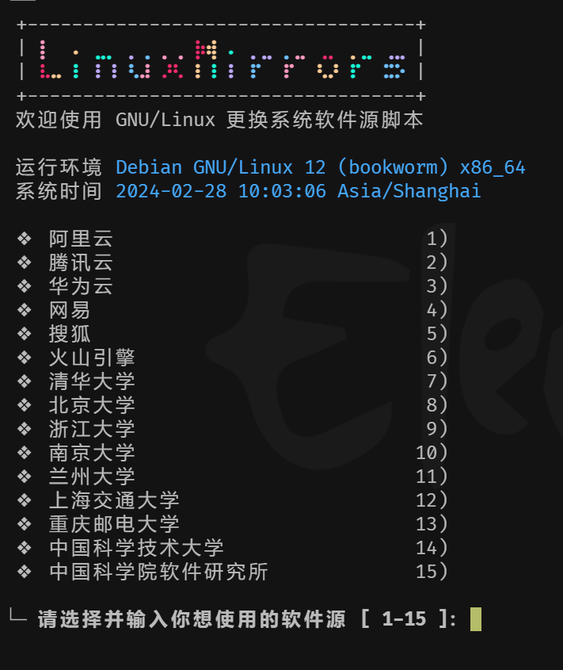
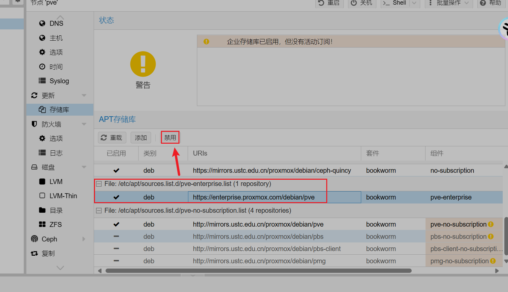

# PVE系列-更换软件&amp;容器源


&lt;!--more--&gt;

### 替换 apt软件源

直接使用下属命令完成一件替换操作

```bash
bash &lt;(curl -sSL https://linuxmirrors.cn/main.sh)
```



​	任意选择一项，等待完成程序运行完即可。

### 修改LXC容器源

​	将 `/usr/share/perl5/PVE/APLInfo.pm` 文件中默认的源地址 `http://download.proxmox.com` 替换为 `https://mirrors.tuna.tsinghua.edu.cn/proxmox` 即可。

​	下面给出命令

```bash
#备份文件
cp /usr/share/perl5/PVE/APLInfo.pm /usr/share/perl5/PVE/APLInfo.pm_back
#修改
sed -i &#39;s|http://download.proxmox.com|https://mirrors.ustc.edu.cn/proxmox|g&#39; /usr/share/perl5/PVE/APLInfo.pm
#重启生效
systemctl restart pvedaemon
```

【Tips】

​	针对 `/usr/share/perl5/PVE/APLInfo.pm` 文件的修改，需重启后才能生效。


### 禁用PVE-Enterperise

​	如下图所示




### 更换Ceph源

​	修改/etc/apt/sources.list.d/ceph.list文件，将内容改成如下所示。

```bash
# deb https://enterprise.proxmox.com/debian/ceph-quincy bookworm enterprise
deb https://mirrors.ustc.edu.cn/proxmox/debian/ceph-quincy/ bookworm no-subscription

cp /usr/share/perl5/PVE/CLI/pveceph.pm /usr/share/perl5/PVE/CLI/pveceph.pm_back
sed -i &#39;s|http://download.proxmox.com|https://mirrors.ustc.edu.cn/proxmox|g&#39; /usr/share/perl5/PVE/CLI/pveceph.pm
```


---

> Author: [w2422](https://www.gvnote.com)  
> URL: https://www.gvnote.com/posts/replace-lxc-container-source/  

