# 飞牛与群晖通过网络共享UPS后备电源


<!--more-->


### 一、实现原理

我们要做的是让飞牛和群晖共用同一台 UPS，在断电时这台UPS能同时通知到两台设备关机保护硬盘。

核心思路是基于NUT 网络 UPS

小知识：飞牛 NAS 虽然没有提供图形化界面来配置网络 UPS，但飞牛UPS底层其实用的是NUT(Server)。

因此，我们可以直接让飞牛作为Nut Servier连接 UPS，再让群晖以客户端模式通过网络连接飞牛的 UPS 服务来实现。

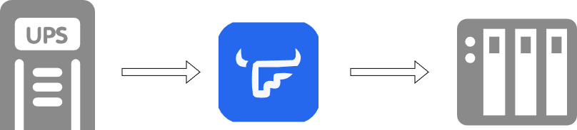


### 二、实现步骤

1. 首先，将 UPS 的 USB 接口连接到飞牛 NAS上面，并在系统设置中打开UPS支持：

   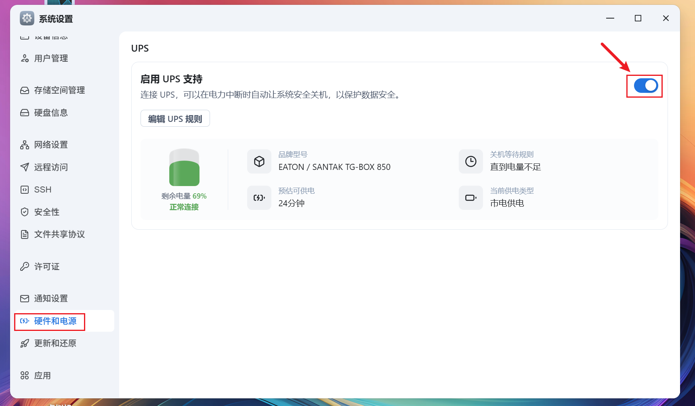

   

2. 开启SSH

   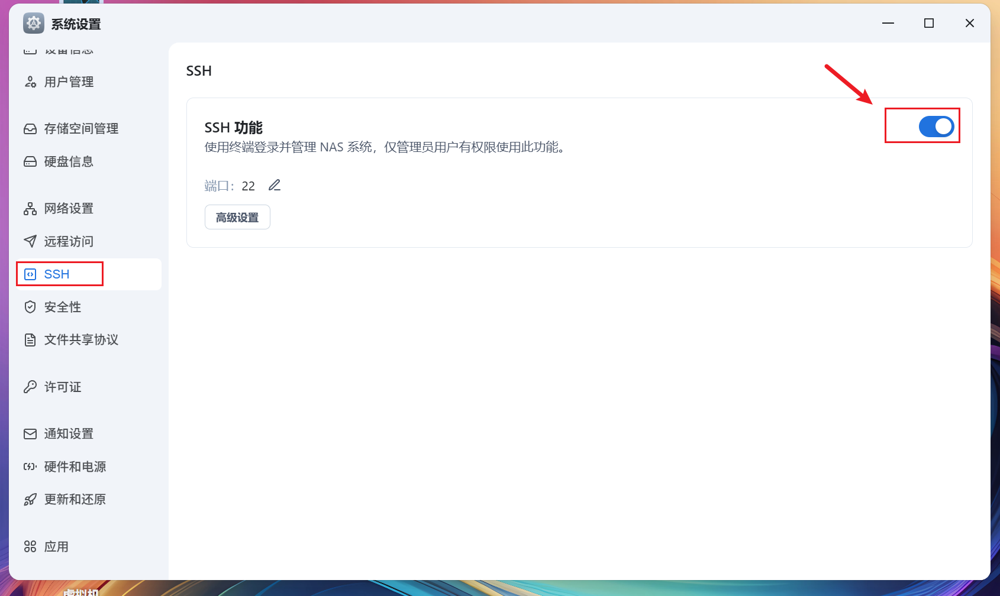

3. 通过xshell、powershell或electerm等终端SSH软件登陆飞牛

   登录后通过 sudo -i 获取管理员(root)权限

   ```shell
   #记得在password for xxx: 输入密码,密码是不显示的
   #复制下述命令执行
   sudo -i
   ```

   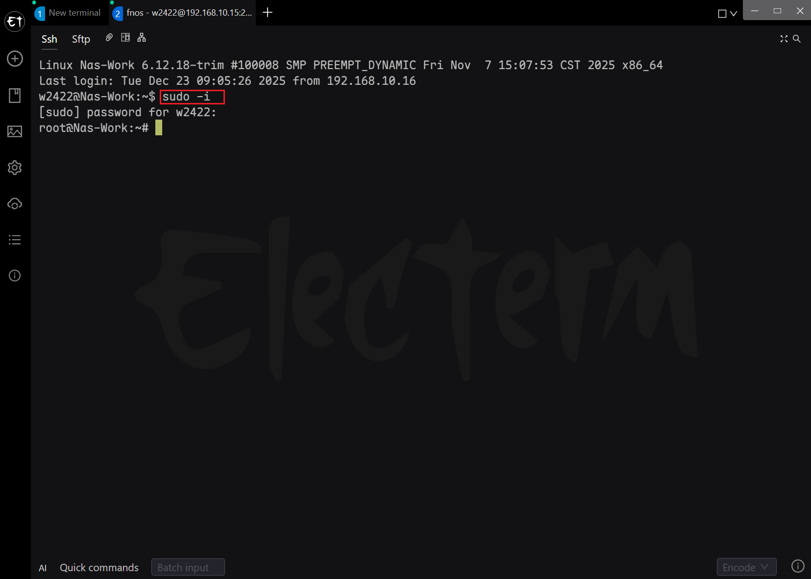

4. 修改Nut配置文件

   修改ups.conf文件，该文件位于/etc/nut目录下。

   修改配置文件前一定要先备份再修改

   ```shell
   #备份
   cp /etc/nut/ups.conf /etc/nut/ups.conf.bak 
   #修改命令
   vim /etc/nut/ups.conf
   ```

   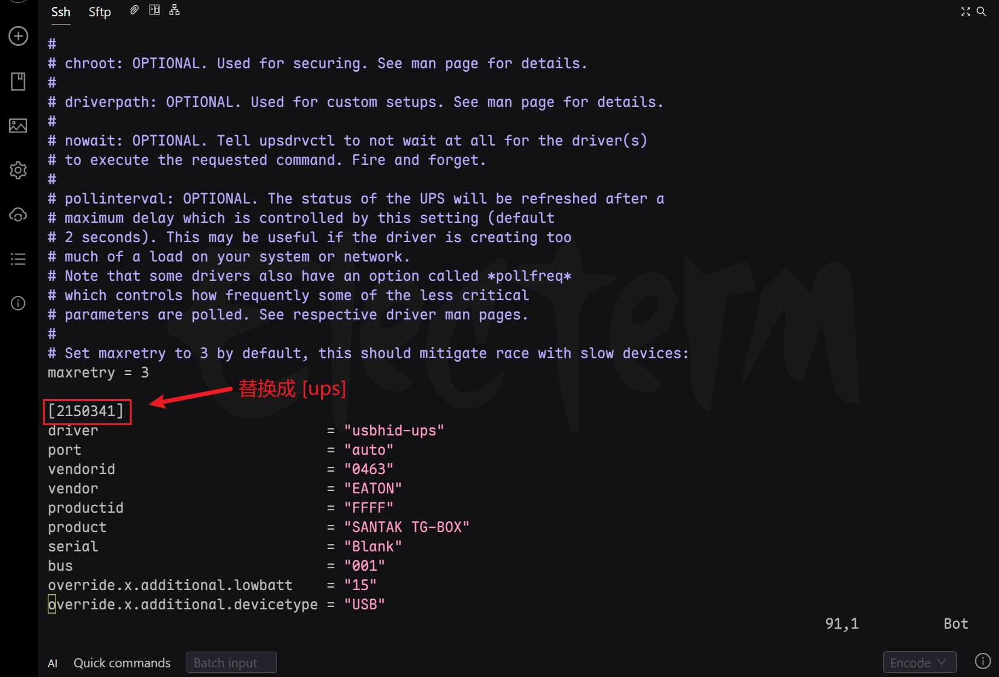

   将上图中的 [21xxx]替换成 [ups]，如下图所示

   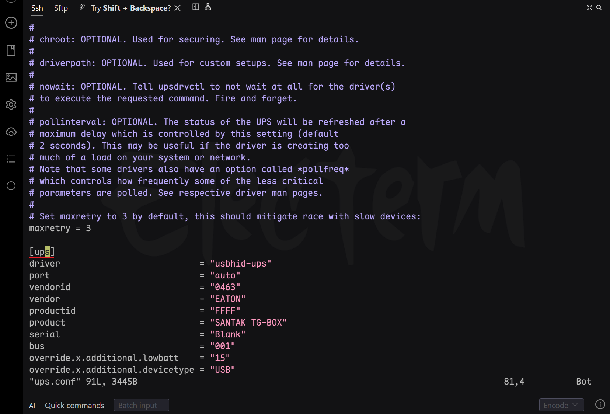

   修改完成后按住：输入:wq 保存退出。此时会在终端界面 弹出UPS掉线通知(board cast)，不用管直接 Enter 进行下一步操作。

   > Tips：
   >
   > 此时进入飞牛-->系统设置-->ups 你会发现ups已经掉线。

5. 修改监控配置文件

   修改upsmon.conf文件，该文件同样位于/etc/nut目录下。操作前一定要先备份~！

   ```shell
   #备份
   cp /etc/nut/upsmon.conf /etc/nut/upsmon.conf.bak 
   #修改命令
   vim /etc/nut/upsmon.conf
   ```

   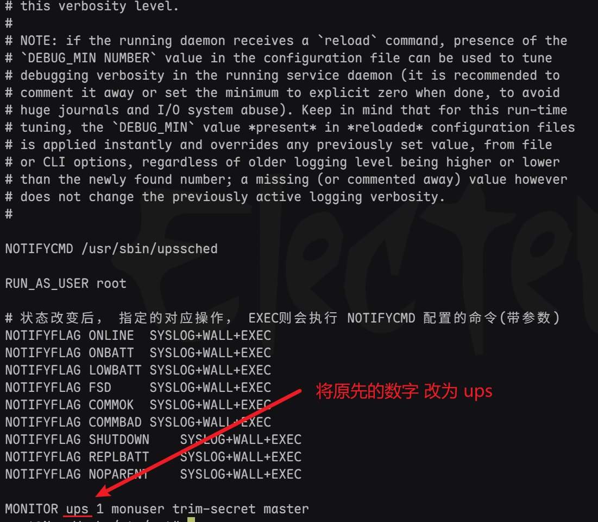

   

6. 修改nut后台进程配置文件

   修改upsd.conf文件，该文件同样位于/etc/nut目录下。操作前一定要先备份~！

   ```shell
   #备份
   cp /etc/nut/upsd.conf /etc/nut/upsd.conf.bak 
   #修改命令
   vim /etc/nut/upsd.conf
   ```

   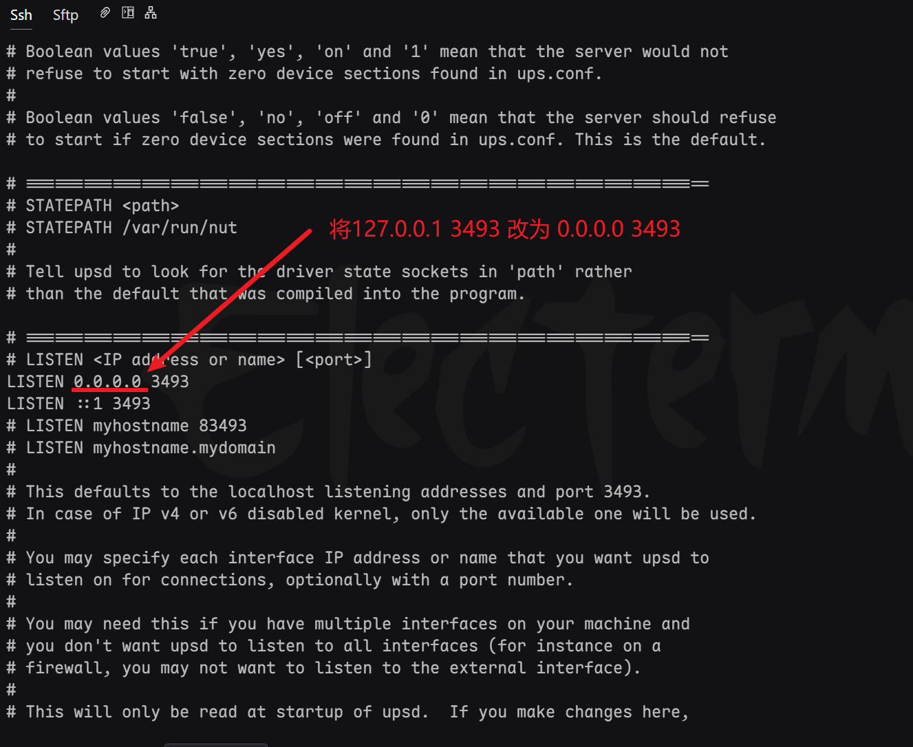

7. 完成以上配置并保存后，直接输入reboot重启，使得配置生效。

8. 重启过后回到飞牛检查ups是否已经在线。

   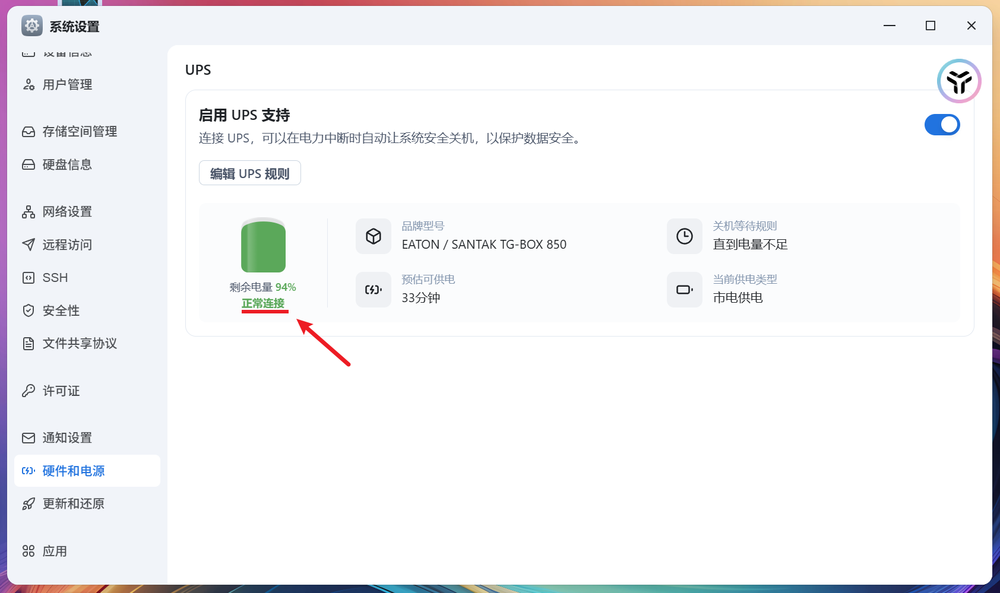

9. 配置群晖

   进入群晖控制面板-->硬件和电源--->不断电系统

   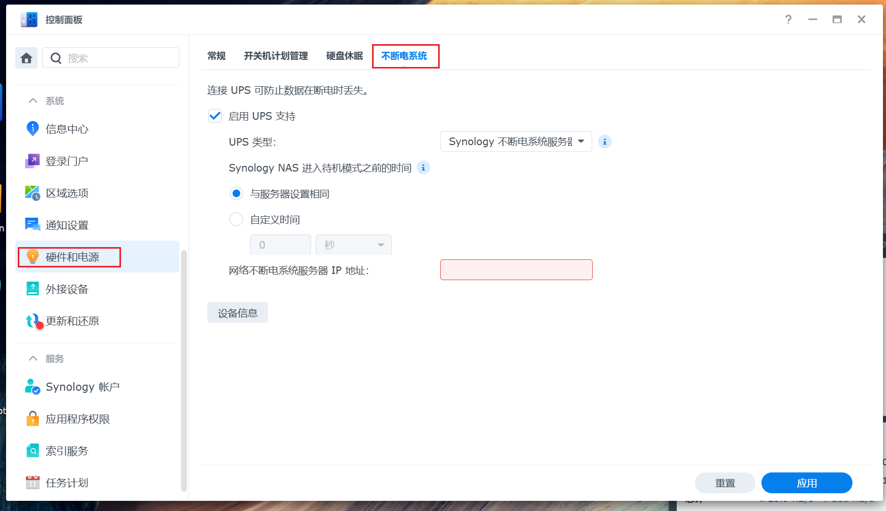

10. 按下图配置

    ①勾选启用ups支持，类型选择 Synology不断电系统服务器

    ②网络不断电系统服务器IP地址填写 飞牛NAS的地址

    ③保存即可

    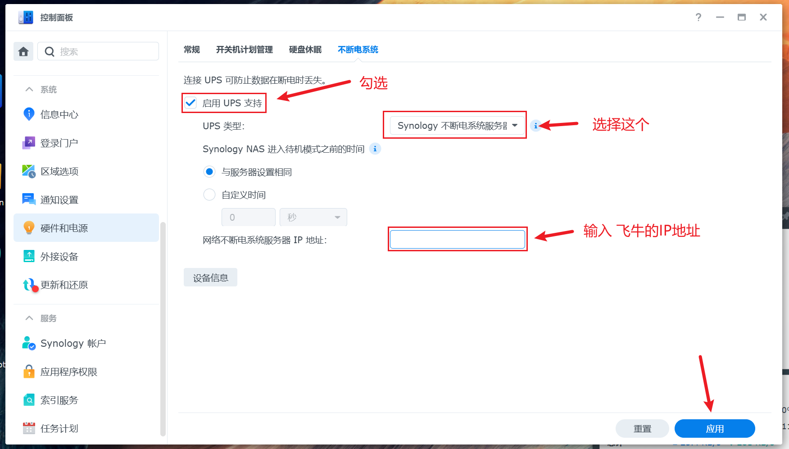

11. 验证是否添加成功

    点击设备信息查看是否已经成功添加

    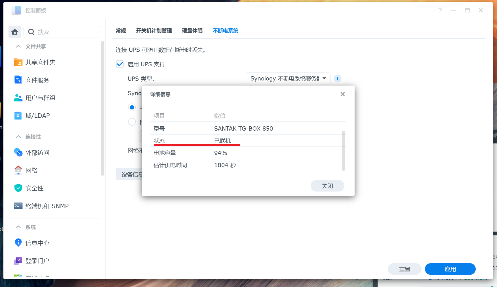


### 三、断电测试

手动断掉 UPS 的市电输入电源，检查两台设备是否都能收到通知：

观察两台机器是否能够顺利关机


---

> 作者: [w2422](https://github.com/z242235718)  
> URL: https://www.gvnote.com/posts/fnos-share-ups-with-synology/  

